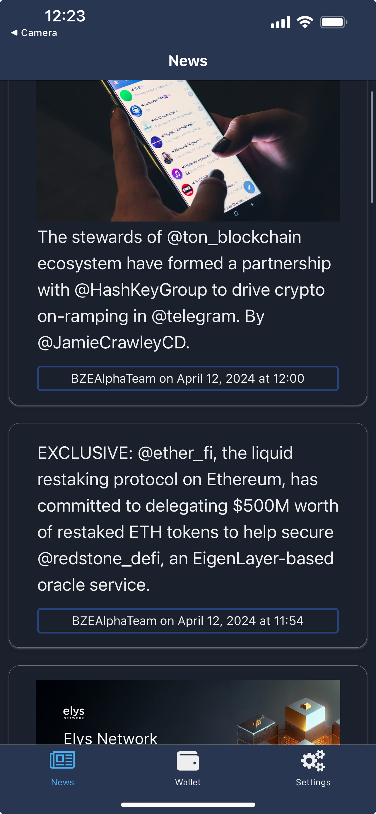
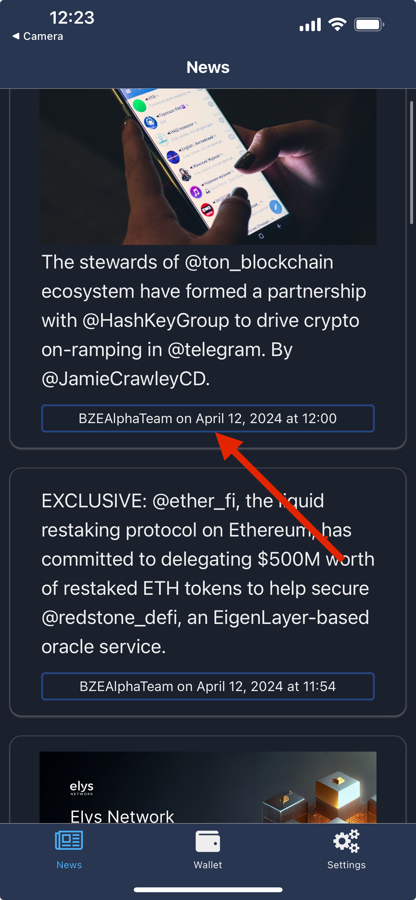
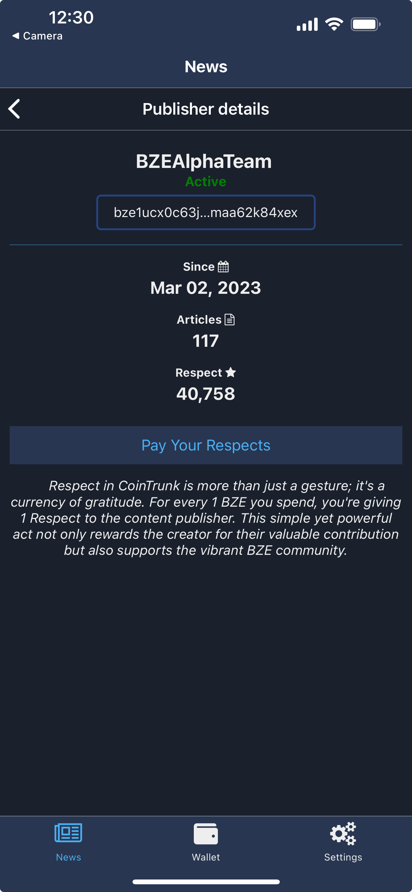
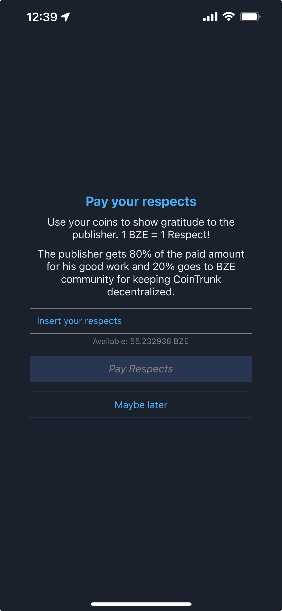

# 📰 News Tab


## News screen

The main screen of the news tab is the news listing screen, where articles from the BZE Blockchain are displayed. Articles are sorted in descending order by their publish date, with the most recent articles appearing first. Scrolling to the bottom of the list and pulling up will load the next page of articles. If you pull down at the top of the list, the app will check the blockchain for new articles and refresh the list if any are available.

<figure><figcaption><p>News tab - news screen</p></figcaption></figure>

Below each article title, there is a button displaying the publisher's name and the publication date. Clicking on this button will open the publisher detail screen.

<figure><figcaption><p>Button to open publisher details screen</p></figcaption></figure>

## Publisher details screen

Publisher details will show the details of the publisher: his name, status on the blockchain, address, the date he joined CoinTrunk as a publisher, number of articles published and the amount of respect he gained from BZE community.&#x20;

<figure><figcaption><p>BZEAlphaTeam publisher details</p></figcaption></figure>

The address of the publisher can be copied by tapping on the address.&#x20;

## Respect in CoinTrunk


```typescriptreact
Respect in CoinTrunk is more than just a gesture; it's a currency of gratitude. For every 1 BZE you spend, you're giving 1 Respect to the content publisher. This simple yet powerful act not only rewards the creator for their valuable contribution but also supports the vibrant BZE community.
```


Users can show gratitude to the publisher by paying some respects. Use "Pay Your Respects"  button to open the form, input the amount of respects you'd like to pay and submit the transaction. 1 point of respect equals 1 BZE coin.

<figure><figcaption><p>Pay publisher respect form</p></figcaption></figure>

The respect will be recorded on the blockchain and the publisher will get the BZE you spent for its respect, minus blockchain's fee. The fee is decided by BZE community through governance proposals and can be found in CoinTrunk module params:&#x20;

```
"publisher_respect_params": {
    "tax": "0.200000000000000000", // 20% of the respects paid
    "denom": "ubze"
}
```

The up-to-date params can be checked on the blockchain [here](../../overview/blockchain-module.md).
