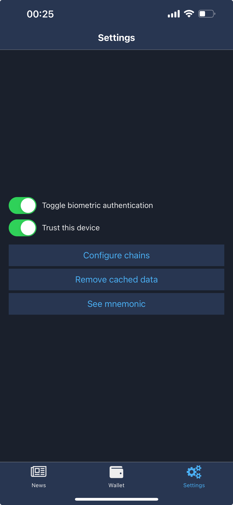
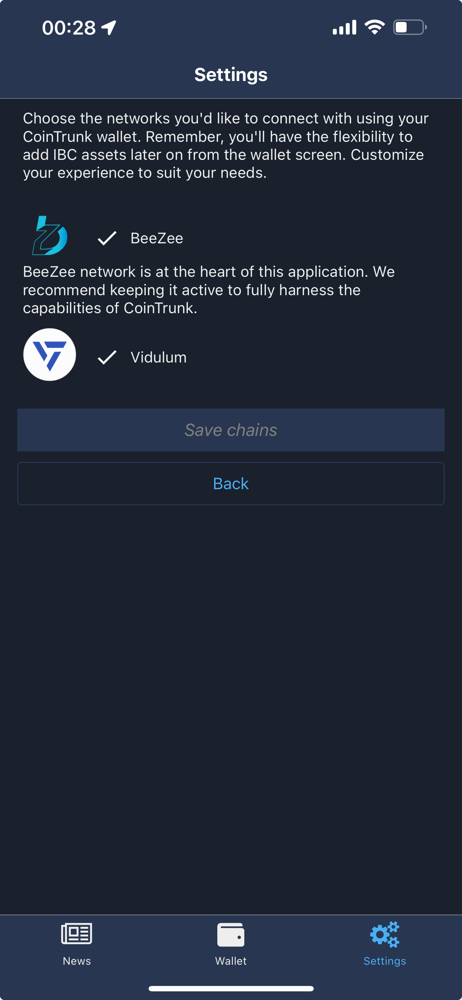

# 🛠️ Settings tab

The settings tab is the one providing access to application configs. The user is able to configure used chains, remove cached data, mark device as trusted or toggle biometrics on/off.&#x20;

<figure><figcaption>
Settings screen
</figcaption></figure>

## Biometrics Auth

If the device allows the app to use biometrics to authenticate the user a toggle will be displayed in the settings screen. Turning it on will switch from authenticating with password to authenting with device's biometrics data.&#x20;

## Trusted device

The user can mark their device as trusted using the toggle in the settings screen. When activated, this feature prevents the app from requesting authentication for 10 minutes after it's entered once. Essentially, after you open the app and authenticate one transaction (whether by password or biometrics), the app will remember the authentication for 10 minutes for subsequent transactions.&#x20;

While this enhances your experience, we do **NOT** recommend using this feature if others have access to your device.

## Configure chains

CoinTrunk will support a wide range of blockchains within the Cosmos ecosystem, offering users the flexibility to select only the blockchain they use. The chains selected here are the ones that will be available in "[Select network](wallet-tab.md#changing-the-blockchain-network)" screen.&#x20;

<figure><figcaption>
Configure chains
</figcaption></figure>

## Remove cached data

This button should only be used in emergencies when inconsistencies are observed in the app's displayed data. We recommend users report any discrepancies before using this button to clear locally cached data. Addressing these inconsistencies helps us identify and fix potential bugs, enhancing your overall experience.

