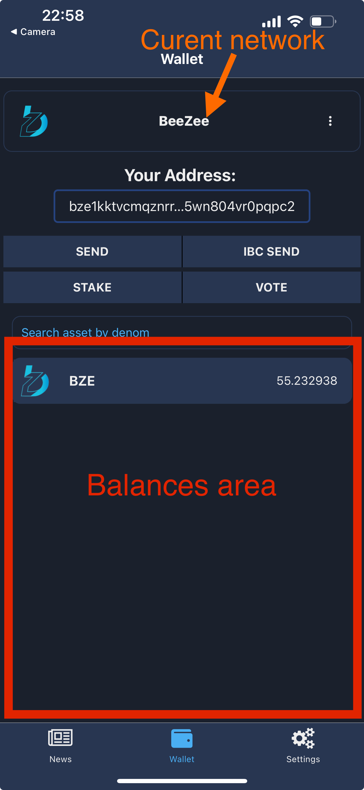
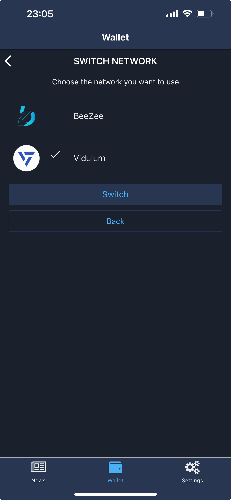
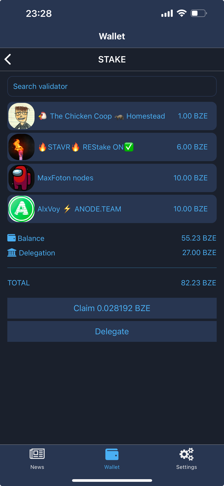
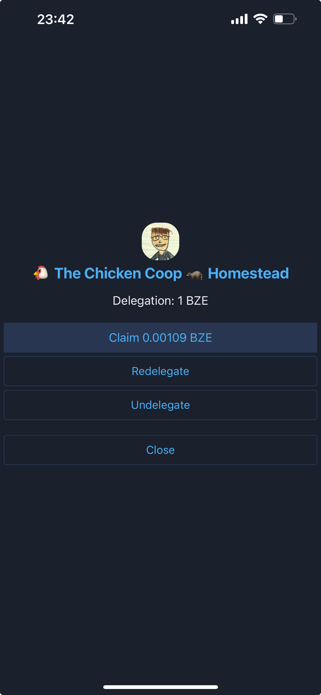
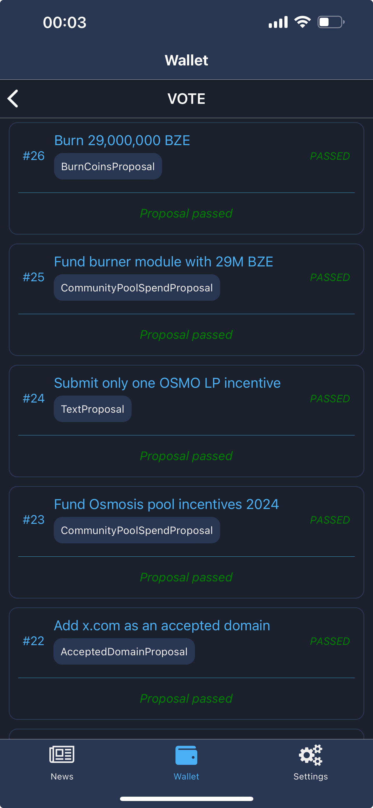
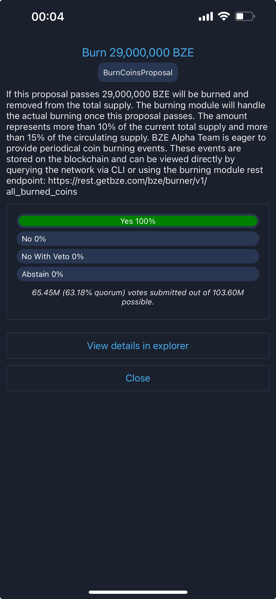

# 💵 Wallet Tab

## Main Screen

The main screen of the wallet tab is displaying current **blockchain**(network), wallet's **address** on the current blockchain(network) and the **balances** available.&#x20;

<figure><figcaption>
Wallet main screen areas
</figcaption></figure>

### Changing the blockchain(network)

The wallet supports multiple blockchains, and users can switch between them by tapping on the current network in the main wallet screen. This action opens the 'Select Network' screen, where users can choose a different network. By pressing the 'switch' button, the wallet will transition to the selected network.

<figure><figcaption>
Switch network screen
</figcaption></figure>

### Copying your address

Tapping on your address in the wallet main screen will copy your address to your clipboard, making you able to easily share it.&#x20;

### Balances and assets

The balances area displays all assets owned by the current address along with their respective balances. The wallet automatically updates balances when sending or receiving coins. However, due to varying network conditions and device capabilities, updates may be delayed or interrupted. In such cases, you can refresh the balances by pulling down on the asset list.

<figure><figcaption>
Pulling down the asset list will refresh the balances
</figcaption></figure>

Users can search through assets list using the search input present above the asset list.

## Stake Screen

The 'Stake' screen is accessible from the wallet's main screen by tapping the 'Stake' button. This screen first displays any existing delegations, followed by a summary of the balances, including spendable balances and delegations, and a total. Below this, there are two buttons: one to claim all rewards from all delegators and another labeled 'Delegate,' which opens the 'Delegate' screen.

<figure><figcaption>
Stake screen
</figcaption></figure>

The user can search for a specific delegation by entering the validator's name in the search input at the top of the screen.

### Delegate screen

On the 'Delegate' screen, users can delegate their coins to a specific validator. The process is straightforward: press 'Pick Validator,' choose a validator from the displayed list, enter the amount you wish to delegate, and tap the 'Delegate' button. <mark style="color:yellow;">**Always remember to keep some spare change available for future transactions.**</mark>

<figure><figcaption>
Delegating your assets
</figcaption></figure>

### Delegation details

From the list of delegations, users can tap on any entry to view available actions. On this screen, users can redelegate, undelegate, or claim rewards. <mark style="color:yellow;">To move coins from one validator to another, use the</mark> <mark style="color:yellow;"></mark><mark style="color:yellow;">**redelegate**</mark> <mark style="color:yellow;"></mark><mark style="color:yellow;">option.</mark> <mark style="color:yellow;"></mark><mark style="color:yellow;">**Avoid**</mark> <mark style="color:yellow;"></mark><mark style="color:yellow;">undelegating if you plan to delegate to another validator, as undelegating initiates a locking period during which you cannot access your coins and will miss out on rewards.</mark> <mark style="color:yellow;"></mark><mark style="color:yellow;">**Redelegation, on the other hand, occurs instantly.**</mark>

<figure><figcaption>
Delegation details
</figcaption></figure>

## Vote

The 'Vote' button opens the voting screen, where users can view the last 35 governance proposals that are either in voting, have passed, or have been rejected. Proposals in other statuses are not displayed to protect users from spammy governance proposals.

<figure><figcaption>
Vote screen - proposals listing
</figcaption></figure>

### Proposal details

The user can view details and cast their vote on any proposal by tapping on it. This action opens the proposal's detail screen, where the user can read the description or visit the explorer to view the entire proposal. If the proposal is still open for voting, a form will be displayed, allowing the user to submit their choice.

<figure><figcaption>
Passed proposal details
</figcaption></figure>

