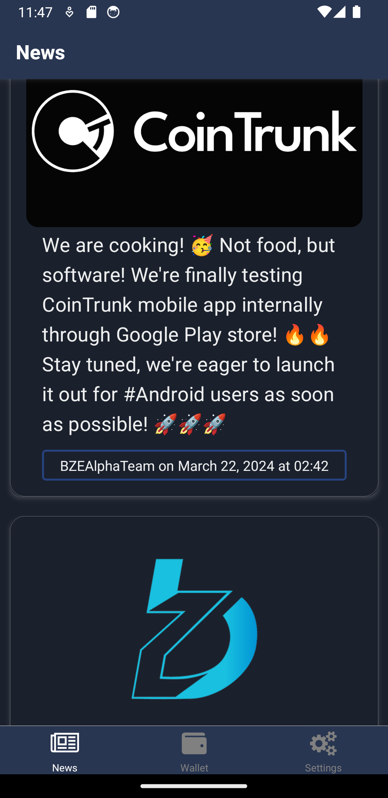
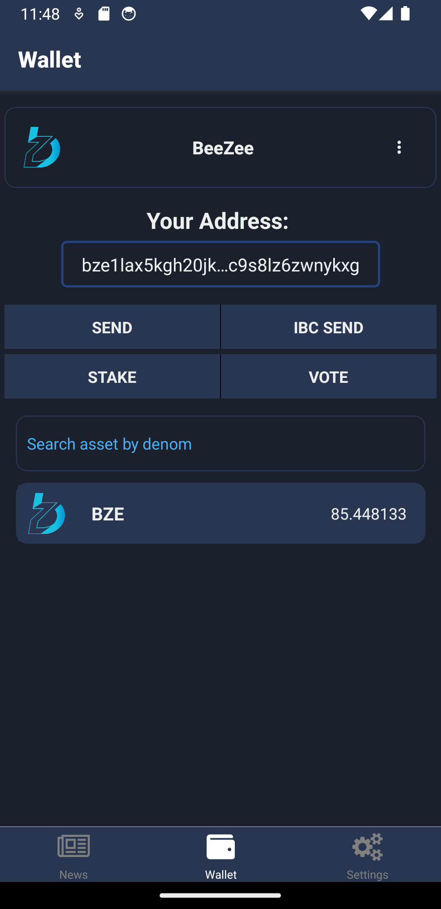
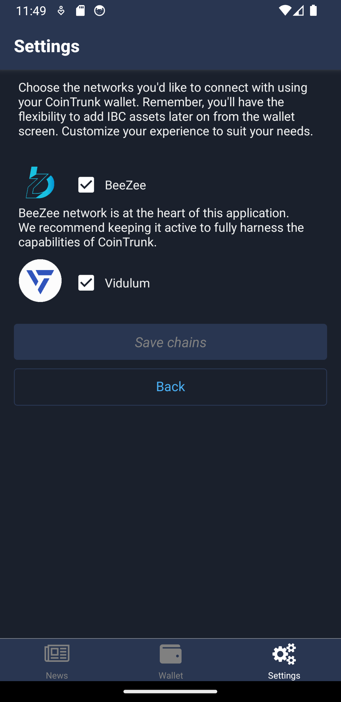

# 📱 Mobile App

The application can be used as a source of information directly from the communities or as your cosmos wallet.&#x20;

## News screen

The primary view in the mobile app is the News screen, designed to be a readily accessible information source right from your mobile device. It provides users with articles published on the blockchain, offering the latest news from the cryptocurrency world.

<figure><figcaption>
News screen
</figcaption></figure>

## Wallet screen

The app doubles as a wallet, supporting multiple networks. It allows users to send assets through the native network or IBC, and participate in delegating or voting on governance proposals.

<figure><figcaption>
Wallet screen
</figcaption></figure>

## Config screen

This screen helps you configure the blockchains you want to use and other application settings.&#x20;

<figure><figcaption>
Networks configuration screen
</figcaption></figure>
